# Структурная схема проекта BookShop

```mermaid
graph TB
    Web[Web]
    
    Web --> Backend[Backend]
    Web --> Pages[Pages]
    Web --> Service[Service]
    
    ' === BACKEND ===
    Backend --> CatalogApp[Catalog App]
    Backend --> OrdersApp[Orders App]
    Backend --> UsersApp[Users App]
    Backend --> ReviewsApp[Reviews App]
    Backend --> AnalyticsApp[Analytics App]
    Backend --> CoreApp[Core App]
    Backend --> WebApp[Web App]
    
    CatalogApp --> CatalogModels[models.py]
    CatalogApp --> CatalogSerializers[serializers.py]
    CatalogApp --> CatalogViews[views.py]
    CatalogApp --> CatalogUrls[urls.py]
    
    OrdersApp --> OrdersModels[models.py]
    OrdersApp --> OrdersSerializers[serializers.py]
    OrdersApp --> OrdersViews[views.py]
    OrdersApp --> OrdersUrls[urls.py]
    
    UsersApp --> UsersModels[models.py]
    UsersApp --> UsersSerializers[serializers.py]
    UsersApp --> UsersViews[views.py]
    
    ReviewsApp --> ReviewsModels[models.py]
    ReviewsApp --> ReviewsSerializers[serializers.py]
    ReviewsApp --> ReviewsViews[views.py]
    
    AnalyticsApp --> AnalyticsModels[models.py]
    AnalyticsApp --> AnalyticsSerializers[serializers.py]
    AnalyticsApp --> AnalyticsViews[views.py]
    
    CoreApp --> CoreDecorators[decorators.py]
    CoreApp --> CoreMiddleware[middleware.py]
    CoreApp --> CoreModels[models.py]
    CoreApp --> CoreRoles[roles.py]
    
    WebApp --> WebViews[views.py]
    WebApp --> WebBuyerViews[buyer_views.py]
    WebApp --> WebAdminViews[admin_views.py]
    WebApp --> WebManagerViews[manager_views.py]
    WebApp --> WebSalesViews[sales_views.py]
    
    ' === PAGES ===
    Pages --> MainPages[Main Pages]
    Pages --> BuyerPages[Buyer Pages]
    Pages --> AdminPages[Admin Pages]
    Pages --> ManagerPages[Manager Pages]
    
    MainPages --> BaseHTML[base.html]
    MainPages --> HomeHTML[home.html]
    MainPages --> CatalogHTML[catalog.html]
    MainPages --> BookDetailHTML[book_detail.html]
    MainPages --> CartHTML[cart.html]
    MainPages --> ProfileHTML[profile.html]
    MainPages --> LoginHTML[login.html]
    MainPages --> RegisterHTML[register.html]
    
    BuyerPages --> AddReviewHTML[add_review.html]
    BuyerPages --> CheckoutHTML[checkout_detailed.html]
    BuyerPages --> EditProfileHTML[edit_profile.html]
    BuyerPages --> OrdersHTML[orders_history.html]
    BuyerPages --> OrderDetailHTML[order_detail.html]
    
    AdminPages --> AdminDashboardHTML[admin/dashboard.html]
    AdminPages --> AdminUsersHTML[admin/users_list.html]
    AdminPages --> AdminBooksHTML[admin_books.html]
    AdminPages --> AdminAuthorsHTML[admin_authors.html]
    AdminPages --> AdminCategoriesHTML[admin_categories.html]
    AdminPages --> AdminInventoryHTML[admin/inventory.html]
    AdminPages --> AdminReportsHTML[admin/reports.html]
    
    ManagerPages --> ManagerDashboardHTML[manager/dashboard.html]
    ManagerPages --> ManagerOrdersHTML[manager/orders.html]
    ManagerPages --> ManagerOrderDetailHTML[manager/order_detail.html]
    ManagerPages --> ManagerStatisticsHTML[manager/statistics.html]
    
    ' === SERVICE ===
    Service --> Database[Database]
    Service --> API[API]
    Service --> StaticFiles[Static Files]
    
    Database --> SQLite[sqlite3]
    Database --> PostgreSQL[PostgreSQL]
    Database --> DBViews[Views]
    Database --> DBProcedures[Procedures]
    Database --> DBTriggers[Triggers]
    
    API --> APIDocs[docs.py]
    API --> APIAuth[Authentication]
    API --> APIEndpoints[Endpoints]
    
    StaticFiles --> StylesCSS[styles.css]
    StaticFiles --> KeyboardJS[keyboard.js]
    StaticFiles --> ThemeJS[theme.js]
    
    classDef backendStyle fill:#e1f5ff,stroke:#01579b,stroke-width:2px
    classDef pagesStyle fill:#fff3e0,stroke:#e65100,stroke-width:2px
    classDef serviceStyle fill:#f3e5f5,stroke:#4a148c,stroke-width:2px
    
    class Backend,CatalogApp,OrdersApp,UsersApp,ReviewsApp,AnalyticsApp,CoreApp,WebApp backendStyle
    class Pages,MainPages,BuyerPages,AdminPages,ManagerPages pagesStyle
    class Service,Database,API,StaticFiles serviceStyle
```

## Описание компонентов

### Backend (Бэкенд)
- **Catalog App**: Управление книгами, авторами, категориями
- **Orders App**: Система заказов и корзины
- **Users App**: Пользователи и профили
- **Reviews App**: Отзывы на книги
- **Analytics App**: Статистика и аналитика
- **Core App**: Декораторы, middleware, роли, аудит
- **Web App**: Веб-представления для разных ролей

### Pages (Страницы)
- **Main Pages**: Основные страницы сайта
- **Buyer Pages**: Страницы для покупателей
- **Admin Pages**: Административная панель
- **Manager Pages**: Панель менеджера заказов

### Service (Сервисы)
- **Database**: База данных (SQLite для разработки, PostgreSQL для продакшена)
- **API**: REST API с документацией
- **Static Files**: Статические файлы (CSS, JavaScript)

